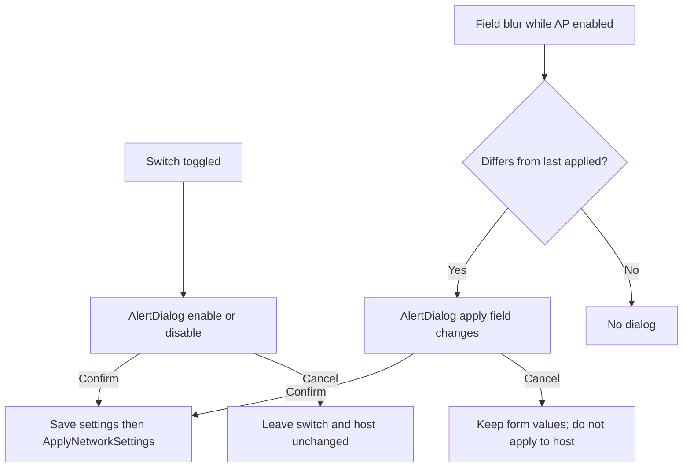

# Access point: switch-driven apply with confirmation

## Goal

In [`WledAccessPointCard.tsx`](frontend/src/components/settings/components/wled/WledAccessPointCard.tsx):

- Remove **Apply network settings** and **Disable AP now (save + apply)**
- Keep **IP neighbors**
- Switch on → confirm → save + apply (bring AP up)
- Switch off → confirm → save + apply (tear AP down)
- While AP is **enabled**, leaving a **changed** field → confirm → save + apply

## Behavior

**Switch:** keep the Switch controlled by `settings.accessPoint.enabled`. On `onCheckedChange`, do **not** update settings yet — store a pending target (`true`/`false`) and open an `AlertDialog`. Confirm sets `enabled` to that target (via existing `updateSettings` / save path), then runs the same save+apply sequence as today’s `applyNetworkSettingsNow`. Cancel closes the dialog and leaves everything as-is.

**Fields:** keep current onChange + autosave. Maintain a `lastAppliedAccessPoint` snapshot (updated after each successful apply, initialized from settings when the card mounts / after snapshot refresh). On blur of connection / interface / SSID / password / channel: if AP is enabled and current `accessPoint` differs from `lastApplied`, open a confirm dialog to apply. Confirm → save + apply and refresh `lastApplied`. Cancel → no apply (saved config may already include the new values; live AP stays on previous applied config until next confirmed apply/toggle/boot).

**Shared apply helper:** reuse the existing save-then-`onApplyNetwork` flow from [`SettingsView.tsx`](frontend/src/components/settings/SettingsView.tsx) (`applyNetworkSettingsNow`). Drop `disableAccessPointNow` once the switch-off path sets `enabled: false` before that same helper.

## UI / files

- [`WledAccessPointCard.tsx`](frontend/src/components/settings/components/wled/WledAccessPointCard.tsx): remove both buttons and `PiWifiHigh`; add local confirm dialog state (toggle + fields); wire Switch and field `onBlur` as above; keep IP neighbors button/modal.
- Use existing [`alert-dialog.tsx`](frontend/src/components/ui/alert-dialog.tsx) (no new dialog primitive).
- [`WledSettingsTab.tsx`](frontend/src/components/settings/tabs/WledSettingsTab.tsx) + [`SettingsView.tsx`](frontend/src/components/settings/SettingsView.tsx): stop passing `disableAccessPointNow`; pass a single `onApplyNetworkNow` (save+apply) into the card (or keep `onApplyNetwork` + let the card call a parent `applyNetworkSettingsNow` callback). Remove unused `disableAccessPointNow` callback.
- Locales [`en/settings.json`](frontend/src/locales/en/settings.json) / [`de/settings.json`](frontend/src/locales/de/settings.json): add confirm title/description/confirm/cancel strings for enable, disable, and apply-field-changes; remove or leave unused keys for the deleted button labels.
- Docs [`docs/settings/network.md`](docs/settings/network.md): replace the “Apply changes” button table with switch + confirmation behavior (and field-change confirm while AP is on).

## Out of scope

- Backend / `nmcli` apply logic unchanged
- Companion settings card
- Auto-apply without confirmation
