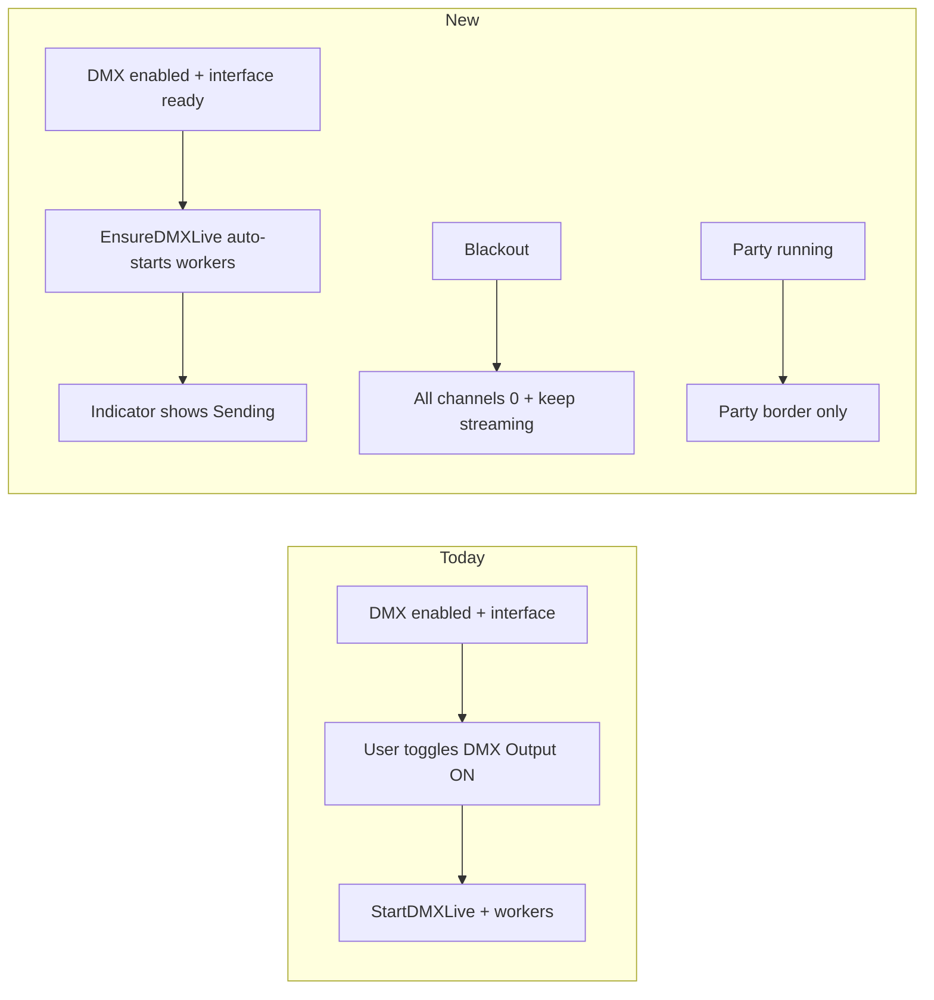

# Auto DMX output (no manual enable)

## Goal

When **DMX is enabled** and a **USB or Art-Net interface is attached/selected and enabled**, the app **starts sending DMX automatically**. Users no longer toggle live output on/off. The party border stays party-only. Blackout stays on Universe/Fixture and **zeros all channels immediately while keeping streamers running**.

## Current vs new model

## Backend

Primary files: [`internal/controller/controller.go`](internal/controller/controller.go), [`internal/controller/dmx_universe_live.go`](internal/controller/dmx_universe_live.go), [`internal/controller/dmx_emergency.go`](internal/controller/dmx_emergency.go), [`internal/controller/dmx_universe.go`](internal/controller/dmx_universe.go), callers in [`dmx_party.go`](internal/controller/dmx_party.go) / [`scenes.go`](internal/controller/scenes.go).

1. **Add `EnsureDMXLiveOutput()`** (idempotent):
   - If `!settings.DMX.Enabled` → `StopDMXLive()` and return.
   - Else set `dmxLiveRunning = true` if needed, reconcile adapters (USB/Art-Net).
   - If no adapter can open → stop live (indicator OFF); do not leave a half-running session.
   - If already running with adapters → no-op (or re-reconcile only).
   - On first successful start in a session, keep existing init seeding via `buildDMXLiveInitUpdates` (same as today’s `StartDMXLive`).

2. **Make `StartDMXLive` a thin wrapper** around ensure (or call ensure) so party/scenes keep working without “already running” errors.

3. **Auto-ensure triggers** (replace “only reconcile if already running”):
   - App boot in `Start()` after settings/DMX load.
   - `SaveSettings` when DMX stays/becomes enabled (already stops when disabled).
   - USB device select / Art-Net enable paths that already call `reconcileDMXLiveAdapters` (e.g. `SetDMXUniverseUSBDevice`) → call `EnsureDMXLiveOutput` instead.
   - Change `reconcileDMXLiveAdaptersLocked` so ensure can bring adapters up from a not-running state (today it early-returns when `!dmxLiveRunning`).

4. **Blackout = option 1 (keep streaming zeros)**:
   - In [`DMXEmergencyStop`](internal/controller/dmx_emergency.go): stop party → blackout all live universes → fan-out → **do not** call `StopDMXLive()`.
   - Update [`dmx_emergency_test.go`](internal/controller/dmx_emergency_test.go): expect `dmxLiveRunning` still true after emergency when adapters were active; channels zeroed; party off.
   - Status text: e.g. `Emergency stop: party off, DMX blackout` (no “output stopped”).

5. **Party border**: no change — still only when `dmxPartyState.status.running` in [`AppShell.tsx`](frontend/src/components/layout/AppShell.tsx). Auto output must not add any shell border.

## Frontend

1. **New shared indicator** `DMXOutputIndicator` (e.g. under `frontend/src/components/dmx/`):
   - Non-interactive control styled like today’s button but `disabled` / `aria-disabled`, no click handler.
   - Label: `DMX Output - ON` when `dmxLiveStatus?.connected`, else `DMX Output - OFF`.
   - Optional title explaining ON = sending packets to attached interface.

2. **Universe** [`DMXUniverseView.tsx`](frontend/src/components/dmx/DMXUniverseView.tsx):
   - Remove `handleToggleAllLive` and the clickable toggle.
   - Keep **Blackout**; replace DMX Output button with indicator.
   - Do **not** apply the old power-on/power-off patch tied to the toggle.

3. **Fixture** [`DMXFixtureEditorView.tsx`](frontend/src/components/dmx/DMXFixtureEditorView.tsx):
   - Remove Start/Stop live toggle and `handleToggleLive`.
   - Keep **Blackout**.
   - Show `DMXOutputIndicator` in the toolbar.
   - Keep a separate **Party active** control (navigate to Settings → Party) when party includes this fixture — that is not the output toggle.

4. **Scenes** [`ScenesView.tsx`](frontend/src/components/scenes/ScenesView.tsx) + [`App.tsx`](frontend/src/App.tsx):
   - Pass `dmxLiveStatus` (or `connected` bool); show the same indicator in the page header when `dmxEnabled`.

5. **Hooks** [`useControllerApp.ts`](frontend/src/hooks/useControllerApp.ts) / [`useDMXController.ts`](frontend/src/hooks/useDMXController.ts):
   - Live patches / party / scenes continue to use start/ensure APIs as needed.
   - UI no longer exposes start/stop for normal operation; keep backend bindings for ensure/party/scenes/tests.
   - Update emergency status string to match backend.
   - After settings/USB changes that already refresh state, ensure live status is pulled so the indicator updates.

6. **Live controls UX**: fixture Live tab remains usable whenever output is connected (auto). Party still blocks manual patches when party owns the fixture (existing banner). No party border for manual/auto DMX-only operation.

## Tests to update/add

- Emergency stop: party cleared, buffer zeros, **live still running** when adapters present.
- Ensure on settings with USB sim / Art-Net: `GetDMXLiveStatus().Connected == true` without a prior manual start.
- Ensure with DMX disabled or no interface: connected false, no workers.

## User docs (comprehensive-user-docs skill)

Follow [`.cursor/skills/comprehensive-user-docs/SKILL.md`](.cursor/skills/comprehensive-user-docs/SKILL.md) and [writing-style-guide](.cursor/skills/comprehensive-user-docs/references/writing-style-guide.md): exact UI labels, sidebar paths, workflows, admonitions; no developer API noise. This is a **targeted update** of existing pages (not a full greenfield manual rebuild). After UI/backend match the new behavior, sync prose and verify with `mkdocs build`.

### Pages that must change

| Page | What to rewrite |
|------|-----------------|
| [`docs/dmx/live-mode.md`](docs/dmx/live-mode.md) | Remove Start/Stop live and **DMX Output - ON/OFF** as user actions. Document auto-start when DMX + interface ready. Indicator-only **DMX Output - ON/OFF**. Blackout zeros channels and **keeps streaming**. |
| [`docs/dmx/universe.md`](docs/dmx/universe.md) | Toolbar: **Blackout** + read-only **DMX Output** indicator. Drop ON/OFF start/stop sections and power-on/off toggle behavior. |
| [`docs/dmx/fixtures.md`](docs/dmx/fixtures.md) | Remove **Start live / Stop live**; document indicator + **Party active**; fix Blackout description (stream continues). |
| [`docs/dmx/index.md`](docs/dmx/index.md) | Daily workflow: configure interface → output starts automatically; Blackout keeps streaming zeros. |
| [`docs/getting-started.md`](docs/getting-started.md) | Blackout steps/tooltip: no “stops live output”; streaming zeros until values change. |
| [`docs/troubleshooting.md`](docs/troubleshooting.md) | Replace “Universe → DMX Output - ON” with interface/settings checks; update Blackout recovery section. |
| [`docs/party-mode/index.md`](docs/party-mode/index.md) | Blackout row: party off + channel zero; output keeps sending. Clarify violet party border is **only** while party runs (software control), not for normal auto DMX. |
| [`docs/scenes/index.md`](docs/scenes/index.md) | Note **DMX Output** indicator on Scenes; DMX apply still needs a configured interface (auto ensure). |
| [`docs/interface/navigation.md`](docs/interface/navigation.md) | Align “DMX live output” status wording with auto-send + indicator; keep party-border description party-only. |
| [`docs/dmx/presets.md`](docs/dmx/presets.md) | Soft updates where copy assumes manual “start live” (idle cue applies when output auto-starts). |

### Docs workflow (skill-aligned)

1. **Recon against final UI** — after code changes, re-read Universe/Fixture/Scenes labels and Blackout tooltip so docs match shipped strings.
2. **Rewrite affected sections** — user voice, bold exact labels, numbered workflows, `!!! note` / `!!! warning` for auto-send and Blackout-keeps-streaming.
3. **Cross-links** — keep relative links between DMX, Party, Scenes, Troubleshooting.
4. **Verify** — `pip install -r requirements-docs.txt && mkdocs build` (or project’s usual docs build) with zero errors; spot-check nav entries still resolve.
5. **No MkDocs/Pages scaffold changes** unless build config is already broken — site already exists; only content updates.

## Out of scope

- Changing party mode control logic beyond using ensure instead of fragile start-if-not-running.
- Rebuilding the entire manual or changing GitHub Pages deploy wiring.
