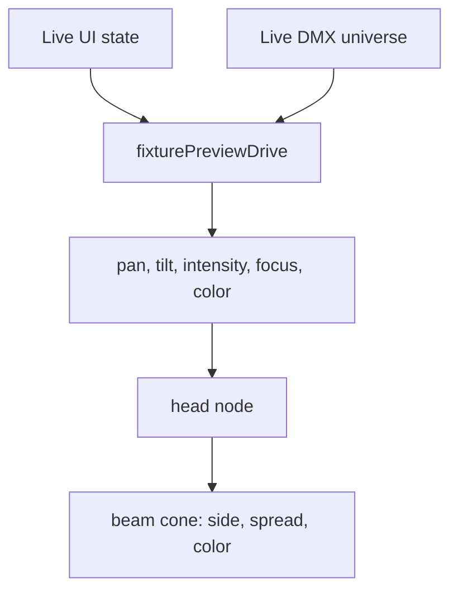

# Beam Cone Preview Plan

## Current Findings
- The beam is currently created inside [frontend/src/components/dmx/DMXFixturePreview3D.tsx](frontend/src/components/dmx/DMXFixturePreview3D.tsx) at local positive Z:

```tsx
const beam = new THREE.Mesh(new THREE.ConeGeometry(0.12 / scale, 0.55 / scale, 20, 1, true), material);
beam.position.set(0, 0.05 / scale, 0.55 / scale);
beam.rotation.set(Math.PI / 2, 0, 0);
```

- [frontend/src/lib/dmxFixturePreviewDrive.ts](frontend/src/lib/dmxFixturePreviewDrive.ts) currently returns only `pan01`, `tilt01`, and `dimmer01`, so the preview cannot yet react to focus or color wheel changes.
- [frontend/src/lib/dmxLiveMap.ts](frontend/src/lib/dmxLiveMap.ts) already has the needed UI state and metadata: `focus01`, `colorWheelIdx`, and parsed color-wheel entries with optional `color` values.

## Implementation
- In [frontend/src/components/dmx/DMXFixturePreview3D.tsx](frontend/src/components/dmx/DMXFixturePreview3D.tsx), flip the beam to the other side of the `head` node by anchoring the cone at the head and pointing it down the opposite local Z axis.
- Rework `createBeamMesh` so the cone apex starts near the lamp/head and widens outward. Prefer transforming the cone geometry once, then use scale to adjust beam spread rather than recreating geometry every frame.
- Add preview props for `focus01` and `beamColor`, with defaults so smoke and older call sites remain safe.
- Use `focus01` to open/close the cone by scaling the beam radius, for example narrow at `0`, medium at `0.5`, wider at `1`. Keep beam length stable unless visual tuning shows it needs a small length adjustment.
- Update the beam material color via `THREE.Color` when `beamColor` changes. For missing, invalid, rainbow, or scroll-style color entries, fall back to the current warm white.
- In [frontend/src/lib/dmxFixturePreviewDrive.ts](frontend/src/lib/dmxFixturePreviewDrive.ts), extend `FixturePreviewDrive` to include `focus01` and `beamColor`.
- Read `focus` from the live universe using the existing `byteTo01` behavior when live DMX is available; otherwise use `fallback.focus01`.
- Resolve color from the live universe’s `colorWheel` DMX value by matching the raw byte into parsed entry ranges; otherwise use `fallback.colorWheelIdx`.
- In [frontend/src/components/dmx/DMXFixtureLiveControls.tsx](frontend/src/components/dmx/DMXFixtureLiveControls.tsx), pass `previewDrive.focus01` and `previewDrive.beamColor` into `DMXFixturePreview3D`.
- Leave gobo projection unchanged for now.

## Verification
- Run `ReadLints` for the edited frontend files.
- Run `npm run build` in [frontend](frontend).
- Manually verify: the cone exits the front side of the head, follows pan/tilt, narrows/widens with Focus, and changes color when selecting color wheel slots.

