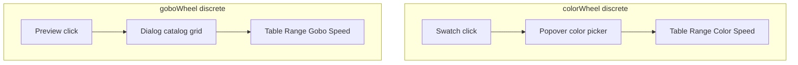

# DMX wheel tables (color + gobo) + pickers + linear range UX

## Context

- Slot editing lives in [`frontend/src/components/dmx/DMXFixtureEditorView.tsx`](frontend/src/components/dmx/DMXFixtureEditorView.tsx) in the `slotMode` branch (~674–862): generic grid with `From`, `To`, `Label`, and gobo-specific fields.
- [`SlotEntry`](frontend/src/components/dmx/DMXFixtureEditorView.tsx) includes `color`, `direction`, `numeric`, `goboIdentifier`, `goboName`, `goboImage`. Live mapping uses `from` / `to` / `label` / `mode` / `color` per [`frontend/src/lib/dmxLiveMap.ts`](frontend/src/lib/dmxLiveMap.ts); extra fields are editor metadata safe for persistence.
- UI primitives: [`frontend/src/components/ui/table.tsx`](frontend/src/components/ui/table.tsx), [`frontend/src/components/ui/dialog.tsx`](frontend/src/components/ui/dialog.tsx), [`frontend/src/components/ui/popover.tsx`](frontend/src/components/ui/popover.tsx).
- Gobo assets: [`frontend/public/gobos/catalog.json`](frontend/public/gobos/catalog.json) is a JSON array of `{ "code": string, "name": string, "image": string }` where `image` is a public path such as `/gobos/images/71001.jpg`. At runtime, load with `fetch("/gobos/catalog.json")` (Vite serves `public/` at site root).

## 1. Color wheel: table + color dot → picker

When `ch.type === "colorWheel"` and `slotMode`:

| Column | Behavior |
|--------|----------|
| **Range** | Same as before: compact **from / to** inputs (or paired inputs) so DMX bands stay editable; header **Range**. |
| **Color** | Circular **swatch** (click target). **Label** remains an editable field beside it (screenshot-style). **Do not** rely on a permanently visible tiny `input type=color` in the row; instead, **clicking the swatch** opens a [`Popover`](frontend/src/components/ui/popover.tsx) (or `Dialog` if you prefer) containing a color control (`input type="color"` and/or hex `Input`) that writes `slot.color` on change/close. |
| **Speed** | Same as prior plan: **−** / **+** for `numeric`, optional `direction` (`cw` / `ccw` / unset) with small icon or select; right-aligned. |
| **Actions** | Remove row; footer **Add slot** / **Add property** with existing append logic. |

## 2. Gobo wheel: table + preview → catalog modal

When `ch.type === "goboWheel"` and `slotMode`, **replace** the current six-column grid with a table aligned to the reference:

| Column | Behavior |
|--------|----------|
| **Range** | Same pattern as color wheel: editable **from / to** for the DMX band. |
| **Gobo** | **Circular preview**: `img` when `goboImage` is a usable URL/path (catalog entries use `/gobos/images/....jpg`); placeholder (e.g. empty open circle or initials) when none. **Clicking the preview** opens a **Dialog** with a searchable scrollable grid of all items from **`/gobos/catalog.json`**. Selecting an item sets `goboIdentifier` ← `code`, `goboName` ← `name`, `goboImage` ← `image` (store the path string as today’s manual “Image path” field expects). Keep an **editable name** (and optionally code) next to the preview in the row, or sync name from catalog on pick only—prefer **label** row field as the slot `label` if that is what live uses, and keep `goboName` in sync with catalog selection for consistency with existing `SlotEntry` fields. |
| **Speed** | Same **−** / **+** (and optional extra control for “effect” rows like shake if you encode via `numeric` / `mode` later); match screenshot density. |
| **Actions** | Remove row; footer add-slot control. |

**Catalog loading:** On modal open (or once per editor mount), `fetch("/gobos/catalog.json")`, parse JSON, handle errors with inline message. Optional: memoize catalog in module-level cache or `useRef` after first successful load to avoid refetch. Large list (~7800+ lines in file): use **virtualized list** only if perf requires it; initial implementation can use a simple scroll grid + **filter input** (by code/name).

**Hidden fields:** Remove redundant always-visible **Gobo code** / **Image path** text columns from the **table row** if the modal sets them; optional “Advanced” collapsible or small link to edit path manually for edge cases.

## 3. Other discrete channel types

`shutterStrobe`, `movementSpeed`, etc.: keep the **existing** multi-column grid unless you explicitly extend them later.

## 4. Linear range: hide Min/Max when 0–255

Unchanged from prior iteration: when `!slotMode` and `minV === 0 && maxV === 255`, hide the two Min/Max inputs; show short copy plus **“Custom range…”** to expand inputs for non-default limits. Scope: all channel types in linear mode (or gate to `colorWheel`/`goboWheel` only if you want narrower behavior).

## 5. Files to touch

- Primary: [`frontend/src/components/dmx/DMXFixtureEditorView.tsx`](frontend/src/components/dmx/DMXFixtureEditorView.tsx) (branching + tables + modal/popover wiring).
- Optionally extract `GoboCatalogPickerDialog` / `ColorSwatchPopover` into colocated components under `frontend/src/components/dmx/` if the main file grows too large—keep imports local to DMX editor unless reused.

## 6. Manual testing

- **Color wheel:** table layout, click swatch → picker updates hex, save/reload fixture.
- **Gobo wheel:** table layout, click preview → catalog loads, pick item → identifiers and image update, thumbnail renders.
- **Linear** 0–255: hidden min/max until “Custom range…”.
- **Regression:** non-wheel discrete channels still work.

