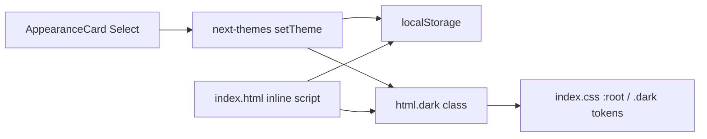

# Dark mode with System / Light / Dark switch

## Approach

Wire up the existing shadcn `.dark` tokens and the already-installed `next-themes` package. Persist preference in **localStorage** (via next-themes), not Go `ControllerSettings` — theme must apply before the backend snapshot loads to avoid a light flash on startup.

Keep the **green primary** brand; tune dark surfaces toward the screenshot’s layered charcoal look (deep workspace, slightly lighter panels/cards). Do not switch the accent to pink.

## Implementation

### 1. Mount theme provider and prevent FOUC

- Update [`frontend/src/main.tsx`](frontend/src/main.tsx): wrap `<App />` in `ThemeProvider` from `next-themes` with:
  - `attribute="class"`
  - `defaultTheme="system"`
  - `enableSystem`
  - `storageKey="goldbus-theme"`
- Update [`frontend/index.html`](frontend/index.html):
  - `suppressHydrationWarning` on `<html>`
  - Small inline script before paint that reads `goldbus-theme` and applies `dark` (or resolves `system` via `prefers-color-scheme`) so the first frame matches the saved preference

### 2. Settings → General UI

- Add [`frontend/src/components/settings/components/AppearanceCard.tsx`](frontend/src/components/settings/components/AppearanceCard.tsx) mirroring [`WindowDisplayCard.tsx`](frontend/src/components/settings/components/WindowDisplayCard.tsx):
  - Card title: **Appearance**
  - Label: **Color mode**
  - shadcn `Select` with options: **System** (`system`), **Light** (`light`), **Dark** (`dark`)
  - Use `useTheme()` from `next-themes`; call `setTheme` on change
  - Guard for SSR/mount so the select doesn’t flash the wrong value (`mounted` state pattern)
- Render it in [`GeneralSettingsTab.tsx`](frontend/src/components/settings/tabs/GeneralSettingsTab.tsx) under `WindowDisplayCard` (no need to pass `settings` / `updateSettings`)

### 3. Dark token polish (screenshot-inspired surfaces)

In [`frontend/src/index.css`](frontend/src/index.css) `.dark` block, nudge surfaces toward layered charcoal while keeping green primary:

- Slightly deeper `--background` (near `#121212`)
- Slightly elevated `--card` / `--popover` / `--sidebar` (near `#1A1A1D`–`#252525`)
- Keep existing green `--primary` / `--sidebar-primary` (brand continuity)

Light `:root` tokens stay as they are.

### 4. Out of scope

- No Go/backend or `ControllerSettings` changes
- No pink accent rebrand
- No full audit of every `bg-white` edge case (few exist; knobs/sliders that intentionally stay white are fine)

## Files to touch

| File | Change |
|------|--------|
| [`frontend/src/main.tsx`](frontend/src/main.tsx) | Mount `ThemeProvider` |
| [`frontend/index.html`](frontend/index.html) | FOUC script + `suppressHydrationWarning` |
| [`frontend/src/components/settings/components/AppearanceCard.tsx`](frontend/src/components/settings/components/AppearanceCard.tsx) | New Select card |
| [`frontend/src/components/settings/tabs/GeneralSettingsTab.tsx`](frontend/src/components/settings/tabs/GeneralSettingsTab.tsx) | Insert Appearance card |
| [`frontend/src/index.css`](frontend/src/index.css) | Tune `.dark` surface tokens |

## Verification

- Settings → General shows Color mode; default is System
- Switching Light / Dark / System updates the UI immediately
- Restart app: preference restored; no prolonged wrong-theme flash
- OS light/dark change updates the app when mode is System
