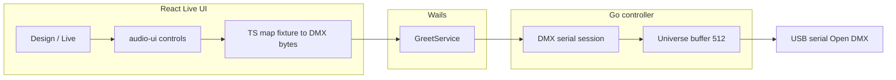

# DMX Live mode (UI + USB DMX output)

## Current state

- Fixture **design** is implemented in [`frontend/src/components/dmx/DMXFixtureEditorView.tsx`](frontend/src/components/dmx/DMXFixtureEditorView.tsx) with rich channel typing (`colorWheel`, `goboWheel`, `pan`/`tilt`, `shutterStrobe`, `movementSpeed`, `focus`, `zoom`, `iris`, `frost`, etc.).
- [`controller.go`](controller.go) persists [`DMXState`](controller.go) (fixtures + `selectedUSBDeviceId`) but **never opens the serial port or sends DMX**.
- USB enumeration + selection already exists ([`ListUSBSerialDevices`](greetservice.go) / [`SetSelectedUSBSerialDevice`](greetservice.go), UI in [`SettingsView.tsx`](frontend/src/components/settings/ControllerSettingsView.tsx)).
- Frontend already depends on `@audio-ui/react` ([`frontend/package.json`](frontend/package.json)) and wraps `Fader` in [`frontend/src/components/audio/fader.tsx`](frontend/src/components/audio/fader.tsx). The package exports **`XYPad`**, **`Knob`**, **`ChannelStrip`**, **`Transport`** ([`node_modules/@audio-ui/react/dist/index.d.ts`](frontend/node_modules/@audio-ui/react/dist/index.d.ts)) — align new wrappers with the same pattern as `fader.tsx` (Tailwind + shadcn tokens). Optional: add more primitives via `npx shadcn@latest add` from the `@audio` registry defined in [`frontend/components.json`](frontend/components.json).

## Architecture

## Backend: USB Open DMX output

1. **Dependency**: Add a cross-platform serial library (e.g. [`go.bug.st/serial`](https://github.com/bugst/go-serial)) in [`go.mod`](go.mod). Configure port for **250000 baud, 8N2** (standard DMX over USB adapters).

2. **New module** (e.g. `dmx_serial.go`):  
   - Resolve `SelectedUSBDeviceID` to `Path` via existing `listUSBSerialDevices()`.  
   - Open port, run a **dedicated goroutine** (~40–44 Hz) that sends a full DMX frame: **BREAK + MAB + start code `0` + 512 slots** using the library’s break support / timing (ENTTEC Open DMX behavior; document assumption in code comments).  
   - Hold a `[512]byte` universe buffer protected by `sync.Mutex` or `atomic`/copy-on-write; writer loop reads snapshot under lock.

3. **`WLEDController` integration** ([`controller.go`](controller.go)):  
   - Fields: live session handle, last error string, optional `fixtureID` for which fixture is being driven (for UI only).  
   - **`StartDMXLive()`**: require non-empty `dmxState.SelectedUSBDeviceID`, device present in list, not already running; start goroutine; clear or zero universe.  
   - **`StopDMXLive()`**: stop goroutine, close port (call from `Stop()` as well so shutdown is clean).  
   - **`ApplyDMXLivePatch(updates []DMXOutputUpdate)`** (or `map[int]int` with JSON-friendly slice): each update = DMX address **1–512** and value **0–255**; clamp and write into buffer. Non-addressed channels stay at last value (or 0 after start — pick one and document).

4. **`GreetService`** ([`greetservice.go`](greetservice.go)): expose `StartDMXLive`, `StopDMXLive`, `ApplyDMXLivePatch`, and **`GetDMXLiveStatus()`** returning e.g. `{ connected, error, devicePath, fixtureId }` so the UI can poll or refresh after calls.

5. **Regenerate bindings** after Go API changes (your existing Wails v3 flow so [`frontend/bindings/changeme/`](frontend/bindings/changeme/) updates).

## Frontend: Design / Live UI

1. **State & wiring** ([`useControllerApp.ts`](frontend/src/hooks/useControllerApp.ts), [`App.tsx`](frontend/src/App.tsx)):  
   - Pass `dmxState`, `usbSerialDevices`, `refreshUSBSerialDevices`, `onSelectUSBSerialDevice` into the fixture view (or only Live) so Live can show **connection readiness** (no device selected → prompt link to Settings / inline refresh).  
   - Add callbacks wrapping new Wails calls: start/stop live, apply patch (debounced ~30–50 ms for sliders/XY to avoid flooding).

2. **Toggle & layout** inside [`DMXFixtureEditorView.tsx`](frontend/src/components/dmx/DMXFixtureEditorView.tsx) **or** a new sibling component imported by it (recommended for size): e.g. `DMXFixtureLiveDashboard.tsx`.  
   - **Design**: current editor (unchanged behavior).  
   - **Live**: only meaningful when `fixture` exists (saved fixture). For “Add fixture” route, hide Live or disable with tooltip.

3. **Live dashboard** (match your reference layout):  
   - **Header**: pill toggle Design | Live; **Edit** returns to Design.  
   - **Connection strip**: status (Disconnected / Connecting / Streaming), selected device name/path, errors from `GetDMXLiveStatus`, **Connect** / **Disconnect** (call Start/Stop). Auto-call `StartDMXLive` when entering Live is optional; explicit button is clearer for debugging.  
   - **Color wheel**: custom SVG/CSS ring driven by `colorWheel` entries (reuse entry colors from fixture props).  
   - **Gobo wheels 1 & 2**: first two `goboWheel` channels in fixture order — numbered slots + optional thumbnail from `goboImage` / catalog path like the editor.  
   - **Position**: **`XYPad`** from `@audio-ui/react` — map pad `x`/`y` (e.g. 0…1 or −1…1) to pan/tilt **degrees** using `fixture.movingHead.maxPan` / `maxTilt`, then to DMX bytes for `pan` / `tilt` (and **Fine** channels if present: optional phase 2 or coarse only first).  
   - **Shutter / strobe**: segmented control mapping to `shutterStrobe` entries (match `mode` / labels where possible).  
   - **Movement speed**: select from `movementSpeed` entries (like editor defaults).  
   - **Focus / Zoom / Iris / Frost**: vertical **`Fader`** or **`Knob`** (new wrapper files under `frontend/src/components/audio/` mirroring [`fader.tsx`](frontend/src/components/audio/fader.tsx)). Frost **Linear | Pulse** toggles subset of entries or `mode` where applicable.  
   - **Shortcuts – Preview**: static list + `useEffect` keyboard listeners for `Shift+D`, `Shift+C`, etc., focusing/scrolling the corresponding panel (accessibility: only when Live container focused or use `aria-keyshortcuts` documentation).

4. **Mapping layer** (new `frontend/src/lib/dmxLiveMap.ts` or similar):  
   - Input: `DMXFixture`, live control model (normalized floats / selected indices).  
   - Output: `DMXOutputUpdate[]` for `ApplyDMXLivePatch`.  
   - Reuse the same structural assumptions as the editor (`entries` with `from`/`to`, linear `min`/`max`). For wheels, set DMX to **middle of slot** `(from+to)/2` rounded, or `from` when `from==to`.

## Testing / validation

- Without hardware: unit-test mapping (TS) and Go buffer apply logic with fake updates.  
- With USB DMX interface: verify universe output with a known sniffer or fixture response.

## Risks / follow-ups

- **Hardware variance**: Open DMX timing works for many FTDI-based dongles; some devices need different baud or drivers — keep framing isolated in `dmx_serial.go` for future variants (e.g. Art-Net).  
- **Universe conflicts**: MVP applies patches only for the **current** fixture’s DMX addresses; overlapping fixtures on one universe are undefined — document or warn in UI.  
- **Fine channels**: initial implementation can drive coarse `pan`/`tilt` only if present.
