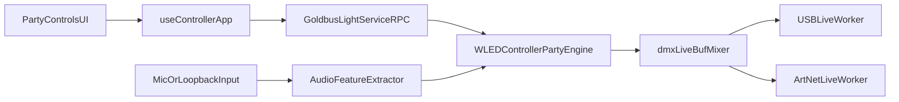

# DMX Party Mode V1 Plan

## Scope And Assumptions
- Deliver both Party submodes in V1:
  - Procedural engine (logical moves/colors/gobos/effects)
  - Audio-reactive engine (microphone + selectable input devices, including loopback devices)
- For host audio, V1 uses selectable input devices (no OS-native system output capture).
- Party mode targets existing single-universe live output path.

## Target Integration Points
- Frontend orchestration/state: [`/Users/florianthievent/workspace/private/GoldbusLight/frontend/src/hooks/useControllerApp.ts`](/Users/florianthievent/workspace/private/GoldbusLight/frontend/src/hooks/useControllerApp.ts)
- DMX universe UI entry point: [`/Users/florianthievent/workspace/private/GoldbusLight/frontend/src/components/dmx/DMXUniverseView.tsx`](/Users/florianthievent/workspace/private/GoldbusLight/frontend/src/components/dmx/DMXUniverseView.tsx)
- Fixture control affordances: [`/Users/florianthievent/workspace/private/GoldbusLight/frontend/src/components/dmx/DMXFixtureLiveControls.tsx`](/Users/florianthievent/workspace/private/GoldbusLight/frontend/src/components/dmx/DMXFixtureLiveControls.tsx)
- Backend controller/live output: [`/Users/florianthievent/workspace/private/GoldbusLight/internal/controller/controller.go`](/Users/florianthievent/workspace/private/GoldbusLight/internal/controller/controller.go)
- Service RPC surface: [`/Users/florianthievent/workspace/private/GoldbusLight/internal/service/goldbuslightservice.go`](/Users/florianthievent/workspace/private/GoldbusLight/internal/service/goldbuslightservice.go)
- DMX update/status types: [`/Users/florianthievent/workspace/private/GoldbusLight/internal/dmx/dmx_live_output.go`](/Users/florianthievent/workspace/private/GoldbusLight/internal/dmx/dmx_live_output.go)

## Architecture

## Implementation Plan
1. **Add Party domain models and persistence**
- Extend DMX/backend models with party config + runtime state (enabled, mode, tempo/intensity/speed, effect families, fixture targeting, audio sensitivity/input device id).
- Persist party configuration with existing DMX state lifecycle so settings survive restart.

2. **Add backend Party engine lifecycle in controller**
- Introduce a Party engine loop owned by `WLEDController` that can run in two generators:
  - `auto`: deterministic/procedural fixture scene generation
  - `audio`: map extracted audio features to fixture channels
- Reuse existing live frame fan-out (`dmxLiveBuf` + `queueLatestDMXFrame`) so USB/Art-Net workers remain unchanged.
- Define strict mixing semantics with manual patches: when Party is active, Party owns configured channels and writes at frame cadence.

3. **Add Party RPC methods**
- In service/controller, add methods for:
  - get party state/status
  - set party config
  - start/stop party mode
  - push audio features (from frontend analyzer)
- Keep method patterns aligned with existing DMX RPC style (`StartDMXLive`, `ApplyDMXLivePatch`, `GetDMXLiveStatus`).

4. **Implement frontend Party controls in DMX universe**
- Add Party panel to DMX universe view for mode switching, start/stop, intensity/speed controls, and fixture inclusion.
- Wire controls through `useControllerApp` with new busy/error handling and refresh flow, consistent with existing DMX actions.

5. **Implement audio input + feature extraction in frontend**
- Use Web Audio APIs to enumerate/select input devices and capture microphone/loopback streams.
- Compute lightweight features (level, beat/energy bands) and send throttled feature updates to backend Party audio mode.
- Add permission/device-state UX and graceful degradation if no input available.

6. **Safety + operational constraints**
- Clamp channel values and update rates to avoid transport overload.
- Auto-stop Party when DMX live output is stopped/disabled.
- Ensure party state is reflected in UI status and survives snapshot/state polling behavior.

7. **Validation and tests**
- Backend unit tests for party scene generation and audio mapping (channel bounds, deterministic behavior, merge semantics).
- Frontend verification for mode switching, device selection, permission failures, and status indicators.
- Manual end-to-end check: fixture set running in auto mode, then audio mode with mic and loopback input device.

## Non-Goals For This V1
- Native OS-specific system output capture without loopback devices.
- Multi-universe DMX party orchestration.
- Full timeline/programmer replacement behavior.
