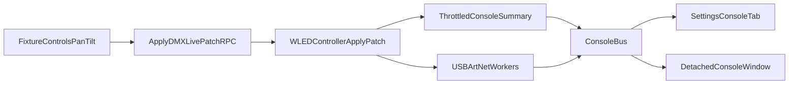

# DMX USB Toggle, Live Console, and Detachable Window

## Goal
Implement three coordinated changes:
- Add explicit USB transport enable/disable in DMX settings (parallel to Art-Net).
- Ensure fixture live changes (pan/tilt etc.) produce visible console output in the selected throttled-summary format.
- Add a detachable native Console window; when detached, hide Console tab in Settings, and when window closes, show Console tab again.

## Implementation Plan

### 1) Add DMX USB transport setting end-to-end
- Extend backend settings model in [`/Users/florianthievent/workspace/private/GoldbusLight/internal/controller/controller.go`](/Users/florianthievent/workspace/private/GoldbusLight/internal/controller/controller.go):
  - Add a USB transport settings field under `DMXSettings` (symmetric with `ArtNet.Enabled`).
  - Set defaults in `DefaultControllerSettings()`.
  - Update `mergeWithDefaults()` DMX config detection so persisted settings remain stable.
- Update adapter reconciliation in `reconcileDMXLiveAdapters()` so USB adapter starts only when DMX is globally enabled, USB transport is enabled, and a USB device is selected.
- Keep USB selection persistence behavior unchanged (selected device can remain stored while USB transport is off).
- Regenerate and align bindings/types:
  - [`/Users/florianthievent/workspace/private/GoldbusLight/frontend/bindings/goldbus/internal/controller/models.ts`](/Users/florianthievent/workspace/private/GoldbusLight/frontend/bindings/goldbus/internal/controller/models.ts)
  - [`/Users/florianthievent/workspace/private/GoldbusLight/frontend/src/types/controller.ts`](/Users/florianthievent/workspace/private/GoldbusLight/frontend/src/types/controller.ts)
- Add a new switch in DMX settings UI in [`/Users/florianthievent/workspace/private/GoldbusLight/frontend/src/components/settings/ControllerSettingsView.tsx`](/Users/florianthievent/workspace/private/GoldbusLight/frontend/src/components/settings/ControllerSettingsView.tsx), and disable USB device controls when USB transport is off.

### 2) Make live fixture changes visible in Console (throttled summaries)
- Add console publishing on DMX live patch activity in [`/Users/florianthievent/workspace/private/GoldbusLight/internal/controller/controller.go`](/Users/florianthievent/workspace/private/GoldbusLight/internal/controller/controller.go):
  - Log throttled summaries (not every patch), including number of changed channels and representative channel/value samples.
  - Reuse existing transport console bus (`c.console.Out(...)`) and add throttle state to avoid flooding.
- Ensure simulator workers also produce transport-style periodic summaries (currently they mostly emit lifecycle info only), so simulated USB/Art-Net mode still shows meaningful activity.
- Keep existing once-per-second transport send summaries for real adapters and harmonize message format to remain readable in the Settings/Console UI.

### 3) Add detachable native Console window with tab hide/show behavior
- Backend window control:
  - Add service methods in [`/Users/florianthievent/workspace/private/GoldbusLight/internal/service/goldbuslightservice.go`](/Users/florianthievent/workspace/private/GoldbusLight/internal/service/goldbuslightservice.go) to open/focus and close the console window.
  - Wire app/window access from [`/Users/florianthievent/workspace/private/GoldbusLight/cmd/goldbuslight/main.go`](/Users/florianthievent/workspace/private/GoldbusLight/cmd/goldbuslight/main.go) so the service can create/manage one secondary window.
  - Open the second window with URL/view marker (query/hash) for console-only rendering.
- Frontend split:
  - Extract current console panel rendering from `SettingsView` into a reusable component (e.g., transport console panel).
  - In [`/Users/florianthievent/workspace/private/GoldbusLight/frontend/src/App.tsx`](/Users/florianthievent/workspace/private/GoldbusLight/frontend/src/App.tsx), branch by URL/view marker:
    - `console-window` view renders only the console panel.
    - normal view renders full app.
- Tab visibility behavior:
  - Add UI state in [`/Users/florianthievent/workspace/private/GoldbusLight/frontend/src/store/controllerStore.ts`](/Users/florianthievent/workspace/private/GoldbusLight/frontend/src/store/controllerStore.ts) and integration in [`/Users/florianthievent/workspace/private/GoldbusLight/frontend/src/hooks/useControllerApp.ts`](/Users/florianthievent/workspace/private/GoldbusLight/frontend/src/hooks/useControllerApp.ts).
  - When detached window opens, hide Console tab in Settings.
  - On detached window close event, restore Console tab automatically.

### 4) Verification
- Manual checks:
  - Toggle DMX USB transport on/off and verify live USB adapter start/stop behavior.
  - In both real and simulated transport modes, move pan/tilt and confirm throttled summary logs appear in Console.
  - Detach Console, confirm Settings tab hides; close detached window, confirm Settings Console tab reappears.
- Run focused checks:
  - Frontend typecheck/build for modified TS files.
  - Go build/test for touched backend packages.

## High-level flow

