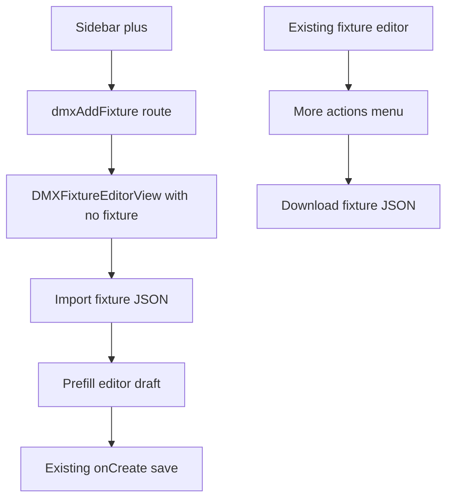

# Fixture Import Export Plan

## Findings
- The sidebar plus button in [frontend/src/components/layout/AppShell.tsx](frontend/src/components/layout/AppShell.tsx) routes to `kind: "dmxAddFixture"`, and [frontend/src/App.tsx](frontend/src/App.tsx) renders the same [frontend/src/components/dmx/DMXFixtureEditorView.tsx](frontend/src/components/dmx/DMXFixtureEditorView.tsx) with `fixture={undefined}` for that add-new state.
- The editor already owns all fixture draft state (`fixtureType`, `brand`, `name`, `address`, `maxPan`, `maxTilt`, `channels`) and saves through the existing `UpsertDMXFixtureInput` shape in [frontend/src/types/controller.ts](frontend/src/types/controller.ts).
- Existing fixture actions already have a dropdown with `Clone` and `Delete`, which is the natural place to add `Export`.

## Implementation
- Add a small frontend helper in [frontend/src/lib/dmxFixtureConfigTransfer.ts](frontend/src/lib/dmxFixtureConfigTransfer.ts) for the JSON contract:
  - export payload version, `type`, `brand`, `name`, `dmxAddress`, `movingHead`, and `channels`
  - omit runtime identity/timestamps (`id`, `createdAt`, `updatedAt`) so imports always create a new fixture
  - parser/validator that returns an `UpsertDMXFixtureInput`-compatible draft or a clear error string
- Update [frontend/src/components/dmx/DMXFixtureEditorView.tsx](frontend/src/components/dmx/DMXFixtureEditorView.tsx):
  - Add `Export` to the existing fixture dropdown beside `Clone` and `Delete`.
  - Export the current editor draft as a pretty JSON file using browser `Blob`/`URL.createObjectURL`, with a safe filename based on brand/name.
  - Add an `Import fixture` button only when `props.fixture` is undefined, visible on the add-new fixture view after the user clicks plus.
  - Wire that button to a hidden `.json` file input; on import, parse/validate the file and populate the draft state without saving automatically.
  - Show import/export errors through the existing `saveHint` message area so the UI style stays consistent.
- Keep save behavior unchanged: after import, the user can edit address/name/channels and click `Save`, which continues using `props.onCreate(input)`.

## Verification
- Run `ReadLints` for [frontend/src/components/dmx/DMXFixtureEditorView.tsx](frontend/src/components/dmx/DMXFixtureEditorView.tsx) and the new helper file.
- Run `npm run build` in [frontend](frontend) to catch TypeScript/Vite issues.
- Manually verify: export an existing fixture, click plus, import the JSON, confirm the fields/channels populate, save, and confirm the imported fixture opens as a new fixture.