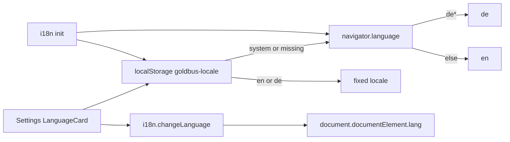

# Frontend i18n (English + German)

## Decisions

- **Library:** `i18next` + `react-i18next` + `i18next-browser-languagedetector`
- **Persistence:** localStorage key `goldbus-locale` with values `system` | `en` | `de` — same pattern as [`goldbus-theme`](frontend/src/main.tsx), **not** Go `ControllerSettings`
- **Detection:** On `system` (default), resolve via `navigator.language` / `navigator.languages`: `de*` → `de`, otherwise `en`. Explicit `en`/`de` overrides. Fallback always `en`.
- **Scope:** Translate **all frontend** user-facing copy (~700–900 locations across app views, hooks, labels, aria/placeholders, status/error strings authored in TS). **Go `fmt.Errorf` messages** that surface via `setError(String(err))` remain English in this pass (follow-up: error codes or Go i18n).
- **Leave untranslated:** product/protocol names as commonly written (`WLED`, `DMX`, `Art-Net`), user-entered data, and numeric/technical identifiers.

## Architecture



## 1. Infrastructure

Install deps in [`frontend/package.json`](frontend/package.json):

```bash
npm install i18next react-i18next i18next-browser-languagedetector
```

Add:

| File | Role |
|------|------|
| [`frontend/src/i18n/index.ts`](frontend/src/i18n/index.ts) | Init i18next; custom detector for `system` → resolve; `fallbackLng: "en"`; `supportedLngs: ["en","de"]`; sync `document.documentElement.lang` on `languageChanged` |
| [`frontend/src/i18n/localePreference.ts`](frontend/src/i18n/localePreference.ts) | Read/write `goldbus-locale`; `resolveLocale(pref)`; helpers used by Settings + detector |
| [`frontend/src/locales/en/*.json`](frontend/src/locales/en/) | English catalogs (namespaces below) |
| [`frontend/src/locales/de/*.json`](frontend/src/locales/de/) | German catalogs |

**Namespaces** (keeps files manageable): `common`, `shell`, `settings`, `scenes`, `dmx`, `wled`, `party`, `status` (hook status/error strings).

Wire in [`frontend/src/main.tsx`](frontend/src/main.tsx): `import "./i18n"` before render (no extra provider needed beyond `I18nextProvider` if we use the default singleton — prefer importing init module + `useTranslation` only).

Optionally extend the existing FOUC script in [`frontend/index.html`](frontend/index.html) to set `<html lang>` from `goldbus-locale` before paint (resolve `system` the same way).

## 2. Settings UI

Add [`../../frontend/src/components/settings/components/general/LanguageCard.tsx`](frontend/src/components/settings/components/LanguageCard.tsx) mirroring [`AppearanceCard.tsx`](frontend/src/components/settings/components/AppearanceCard.tsx):

- Title / help / label via `t(...)`
- Select: **System** (`system`), **English** (`en`), **Deutsch** (`de`) — language names stay in their native form
- On change: write `goldbus-locale`, call `i18n.changeLanguage(resolveLocale(pref))`
- Mount guard so Select doesn’t flash

Render under `AppearanceCard` in [`GeneralSettingsTab.tsx`](frontend/src/components/settings/tabs/GeneralSettingsTab.tsx).

## 3. Translation usage patterns

**Components:**

```tsx
const { t } = useTranslation("settings");
<CardTitle>{t("appearance.title")}</CardTitle>
```

**Hooks / non-React** ([`useControllerApp.ts`](frontend/src/hooks/useControllerApp.ts), libs):

```ts
import i18n from "@/i18n";
setStatus(i18n.t("status:sceneSaved", { name }));
```

**Interpolation** for dynamic copy (`Scene "{{name}}" saved`). Prefer keys over concatenating translated fragments.

**Lists/options** that today are hardcoded English arrays (nav labels, select options, channel UI labels) move into locale JSON or are mapped through `t` at render time.

## 4. Full string sweep (by area)

Replace hardcoded English in feature order so the app stays usable after each chunk:

1. **Shell / common** — [`AppShell.tsx`](frontend/src/components/layout/AppShell.tsx), [`AppErrorBanner.tsx`](frontend/src/components/layout/AppErrorBanner.tsx), shared buttons/labels
2. **Settings** — all tabs + cards under [`components/settings/`](frontend/src/components/settings/)
3. **Status/errors authored in TS** — [`useControllerApp.ts`](frontend/src/hooks/useControllerApp.ts), [`useDMXController.ts`](frontend/src/hooks/useDMXController.ts), [`useDeviceDetail.ts`](frontend/src/hooks/useDeviceDetail.ts)
4. **Scenes** — `ScenesView`, `ScenesEditor`, `TransferList`
5. **WLED** — device detail, add device, general panel, pickers
6. **DMX** — universe view, fixture editor, cue manager/sequence, channel editors, live layout
7. **Party** — `PartyModeView`, party tuning, party settings

German translations: natural UI German (Sie/du: use **du**-friendly concise UI tone consistent with lighting/console apps, or formal **Sie** — use **neutral short labels** without addressing the user where possible; for sentences use **Sie** for a desktop app). Prefer clear, short control labels.

## 5. Out of scope

- Go/backend string translation and `ControllerSettings.locale`
- Translating generated Wails bindings
- CMS / remote locale loading

## Verification

- Fresh install (no `goldbus-locale`): OS German → UI German; OS English/other → English
- Settings → Language: System / English / Deutsch switches UI immediately and survives restart
- Fallback: missing key shows English (or key only if en missing — avoid missing en keys)
- Spot-check Scenes, Settings, DMX editor, Party, sidebar nav in both languages
