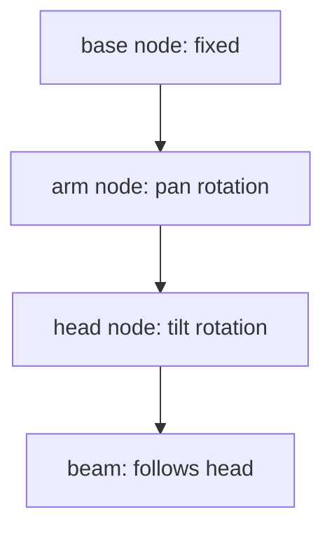

# Moving Head Preview Plan

## Mesh Findings
- The moving-head Collada file at [frontend/public/meshes/moving_head.dae](frontend/public/meshes/moving_head.dae) has a usable hierarchy: `base` contains `arm`, and `arm` contains `head`.
- The current preview at [frontend/src/components/dmx/DMXFixturePreview3D.tsx](frontend/src/components/dmx/DMXFixturePreview3D.tsx) rotates wrapper groups around the whole cloned scene:

```tsx
<group ref={pivot}>
    <group ref={head}>
        <primitive object={rootObj}/>
```

- That explains why the base rotates together with the head. The implementation should target the imported `arm` and `head` nodes instead.

## Implementation
- In [frontend/src/components/dmx/DMXFixturePreview3D.tsx](frontend/src/components/dmx/DMXFixturePreview3D.tsx), clone and normalize the Collada scene as before, but also resolve `root.getObjectByName("arm")` and `root.getObjectByName("head")` for moving-head fixtures.
- Apply pan rotation to the imported `arm` node so the base remains stationary while the yoke and head rotate together.
- Apply tilt rotation to the imported `head` node so only the lamp/head moves inside the yoke.
- Move the beam mesh into the same transform space as the imported `head` node, likely by rendering a small `Beam` component attached through a React ref/group positioned to follow the `head` node transform, or by adding a `THREE.Mesh` child to the cloned `head` node during setup.
- Preserve the existing smoke preview path and opacity behavior; smoke should continue using the whole-root opacity and no articulated node lookup.
- If the DAE node names are missing, fall back gracefully to the existing wrapper behavior or a no-op rotation, with a small local helper to keep the code readable.

## Angle Mapping
- Keep the UI’s degree labels as they are in [frontend/src/components/dmx/DMXFixtureLiveControls.tsx](frontend/src/components/dmx/DMXFixtureLiveControls.tsx).
- For visual pose, map DMX midpoint to the neutral model pose: `visualPan = panDeg - maxPan / 2` and `visualTilt = tiltDeg - maxTilt / 2`. This makes the default `0.5` live-control state look centered while endpoints still represent the configured mechanical range.
- To support that cleanly, pass `maxPanDeg` and `maxTiltDeg` into `DMXFixturePreview3D`, or pass normalized `pan01`/`tilt01` plus max ranges instead of precomputed absolute degrees.

## Verification
- Run `npm run build` in [frontend](frontend) after implementation to catch TypeScript/Vite issues.
- Manually verify the moving-head preview: pan leaves the base fixed and rotates the yoke/head; tilt rotates only the head and beam; smoke preview remains unchanged.

