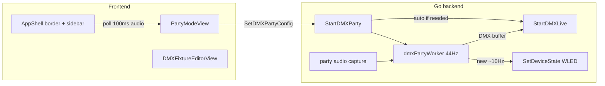

# Party Mode Page Redesign

## Current state

- Party UI lives in [`DMXPartyPanel.tsx`](frontend/src/components/dmx/DMXPartyPanel.tsx), embedded only in [`DMXUniverseView.tsx`](frontend/src/components/dmx/DMXUniverseView.tsx).
- Backend party logic is DMX-only in [`dmx_party.go`](internal/controller/dmx_party.go); config has `fixtureIds` only; empty list = all fixtures.
- `StartDMXParty()` **requires DMX live already running** — user must click "Start live" on a fixture first.
- Audio features update in Go via native capture (~real-time), but the UI polls `GetDMXPartyState` every **1500ms** — too slow for an equalizer.
- Party worker keeps running when navigating away (no stop on route change); only explicit Stop or DMX disconnect stops it.



---

## 1. Routing and navigation

**Files:** [`frontend/src/types/controller.ts`](frontend/src/types/controller.ts), [`frontend/src/store/controllerStore.ts`](frontend/src/store/controllerStore.ts), [`frontend/src/components/layout/AppShell.tsx`](frontend/src/components/layout/AppShell.tsx), [`frontend/src/App.tsx`](frontend/src/App.tsx)

- Add `DetailRoute`: `{ kind: "party" }`.
- Insert a new sidebar section **above the WLED block** (visible when `wledEnabled || dmxEnabled`):
  - Label: **Party** (can rename to "Automode" in one string if you prefer).
  - Icon: e.g. `PiSparkle` or `PiMusicNotes`.
  - Active state when `route.kind === "party"`.
  - Small running indicator on the nav item when `party.status.running`.
- Wire `App.tsx` to render the new page when `route.kind === "party"`.
- Remove `DMXPartyPanel` and all party props from [`DMXUniverseView.tsx`](frontend/src/components/dmx/DMXUniverseView.tsx).

---

## 2. New Party page UI

**New file:** `frontend/src/components/party/PartyModeView.tsx`  
**Refactor from:** [`DMXPartyPanel.tsx`](frontend/src/components/dmx/DMXPartyPanel.tsx) (keep or delete old file after migration)

Layout (top to bottom):

| Section | Content |
|---------|---------|
| Header | Title, Start/Stop button, running status |
| Mode | Auto vs Audio reactive (existing select) |
| Sliders | Intensity, speed, color variation, audio sensitivity (existing) |
| Audio source | Preset + device pickers (existing logic from `DMXPartyPanel`) |
| Equalizer | New `PartyAudioEqualizer.tsx` — 5 animated bars (level, bass, mid, treble, beat) driven by `party.audio.*` (0–1) |
| WLED targets | Scrollable checkbox list of online WLED devices + Select all / Clear |
| DMX targets | Scrollable checkbox list of fixtures + Select all / Clear (migrate existing fixture list) |

**Start button behavior (frontend + backend):**
- Remove the "Start DMX live first" gate from the UI.
- On Start: call `StartDMXParty()`; backend auto-starts DMX live if any DMX fixture is included and live is not connected.
- Disable Start when no devices selected in either list (or show clear error from backend).

**Equalizer refresh:**
- In [`useControllerApp.ts`](frontend/src/hooks/useControllerApp.ts), add a fast poll (~**100ms**) for `GetDMXPartyState` when:
  - `party.status.running && party.config.mode === "audio"`, **or**
  - user is on the party route (so bars animate even while configuring before start).
- Keep the existing 1500ms poll for general status when party runs elsewhere.

---

## 3. Global party chrome (animated border)

**File:** [`AppShell.tsx`](frontend/src/components/layout/AppShell.tsx)

- Pass `partyRunning: boolean` into `AppShell`.
- Wrap `SidebarProvider` (or `SidebarInset` + sidebar as one unit) with a conditional class when `partyRunning`:
  - Fixed/inset animated hue border (CSS `@property` + `animation: hue-rotate` on `outline`/`box-shadow`, or a pseudo-element ring).
  - Must not block clicks; use `pointer-events-none` on the decorative layer.
- Party continues when leaving the page — border stays visible app-wide while running.

---

## 4. Sidebar and fixture-page indicators

**New helper:** `frontend/src/lib/partyTargets.ts`

```ts
isFixtureInParty(fixtureId, config)  // empty fixtureIds => all (keep backward compat)
isWledInParty(deviceId, config)      // same for wledDeviceIds
```

**AppShell sidebar updates:**
- WLED device rows: violet/party dot or ring when `isWledInParty(id)`; pulse or stronger when party is running.
- DMX fixture rows: replace/fix current live dot logic — show **party-active** when `partyRunning && isFixtureInParty(id)`; keep green live dot when that fixture is the manual live target and party is not driving it.

**[`DMXFixtureEditorView.tsx`](frontend/src/components/dmx/DMXFixtureEditorView.tsx):**
- When `partyRunning && isFixtureInParty(fixture.id)`: change Start/Stop live button to **"Party active"** (disabled or opens party page); live tab controls stay blocked (already via `partyRunning`).
- When fixture is included but party not running: optional subtle "Included in Party" hint on live button area.

**[`DMXFixtureLiveControls.tsx`](frontend/src/components/dmx/DMXFixtureLiveControls.tsx):** keep existing party banner; optionally mention "included in Party" vs "all channels party-owned".

---

## 5. Backend: config, auto-live, WLED driving

**Files:** [`internal/controller/dmx_party.go`](internal/controller/dmx_party.go), [`internal/controller/controller.go`](internal/controller/controller.go), [`internal/service/goldbuslightservice.go`](internal/service/goldbuslightservice.go)

### Config extension

Add to `DMXPartyConfig`:

```go
WLEDDeviceIDs []string `json:"wledDeviceIds,omitempty"`
```

Mirror in [`frontend/src/types/controller.ts`](frontend/src/types/controller.ts) and regenerate bindings (`wails3 generate bindings ...`).

Add `filterPartyWLEDDevices(devices, wledDeviceIds)` — same empty-list = all semantics as fixtures.

### StartDMXParty changes

1. Validate at least one target (WLED and/or DMX) after filtering.
2. If DMX targets exist and `!dmxLiveIsConnected()` → call `StartDMXLive("")` (universe-wide; `fixtureId` is metadata only).
3. Start DMX worker only when DMX targets exist.
4. Allow party start when **only WLED** targets selected (no DMX live requirement).

### WLED party output (new)

In `dmxPartyWorker` (or a shared tick called from it), every ~4th frame (~11 Hz) call new `applyPartyToWLEDDevices(state, motionPhase, colorPhase)`:

- For each included, online, non-ignored WLED device:
  - **Auto mode:** hue from `colorPhase`, brightness from intensity + slow oscillator (reuse party math from DMX color phase).
  - **Audio mode:** brightness from `level`/`beat`, hue from bass/mid/treble blend + `colorVariation`.
  - Send compact state via existing `SetDeviceState` / `applyWLEDState` (e.g. `{ "on": true, "bri": N, "seg": [{ "col": [[r,g,b]], "fx": ..., "pal": ... }] }`).
  - Respect `isNoOpStatePatch` to limit HTTP spam.

### Persist / normalize

- Include `wledDeviceIds` in `normalizeDMXPartyConfig` and DMX JSON persist path (already saves full `Party` state in `dmx.json`).
- On load, keep `running = false` (existing safety — no auto-resume after restart).

---

## 6. Manual control while party runs (smoke use case)

No change to stop-on-navigate (party keeps running).

**Important for your workflow:** exclude the smoke fixture from the DMX party checkbox list. Party-owned DMX addresses still block manual patches ([`ApplyDMXLivePatch`](internal/controller/controller.go)); non-included fixtures (e.g. smoke) remain manually controllable on their fixture page while lights stay in party mode.

---

## 7. Testing checklist

- Party page: select WLED + DMX subsets, start/stop, mode switch auto/audio.
- Start party without pre-starting DMX live → live auto-connects, fixtures animate.
- WLED-only party start works with DMX disabled or no DMX fixtures selected.
- Equalizer bars move smoothly in audio mode (~10 updates/sec).
- Animated border visible on all routes while party runs; gone after stop.
- Navigate to smoke fixture (not in party list) → manual live works while party runs on lights.
- Sidebar dots update for included devices; fixture page shows "Party active" when included.
- `go test ./internal/controller/...` for new filter/WLED helpers; frontend `npm run build`.

---

## Files touched (summary)

| Area | Files |
|------|-------|
| Route + shell | `controller.ts`, `controllerStore.ts`, `AppShell.tsx`, `App.tsx` |
| Party UI | `PartyModeView.tsx`, `PartyAudioEqualizer.tsx`, remove from `DMXUniverseView.tsx` |
| Hooks | `useControllerApp.ts` (fast audio poll) |
| Helpers | `partyTargets.ts` |
| Fixture UI | `DMXFixtureEditorView.tsx`, `AppShell.tsx` sidebar |
| Backend | `dmx_party.go`, `controller.go`, `goldbuslightservice.go`, tests |
| Bindings | regenerate `frontend/bindings/` |
