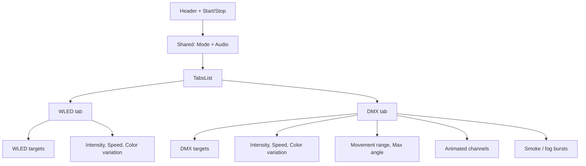

# Separate Party config into WLED / DMX tabs

## Approach

Refactor [`frontend/src/components/party/PartyModeView.tsx`](frontend/src/components/party/PartyModeView.tsx) only (UI layout). No backend or config schema changes — Intensity / Speed / Color variation remain shared config fields but are shown in both tabs where they apply.

Use existing shadcn [`Tabs`](frontend/src/components/ui/tabs.tsx).

## Page structure

**Always visible (above tabs)**
- Title, running status, Start/Stop
- Mode (Auto / Audio reactive)
- When mode is audio: source preset, devices, equalizer, sensitivity (audio sensitivity stays here — shared input for both systems)

**WLED tab**
- Device target checklist + select all/clear
- Sliders: Intensity, Speed, Color variation
- Short helper text that WLED is LED-strip color/brightness only (no movement)

**DMX tab**
- Fixture target checklist + select all/clear
- Sliders: Intensity, Speed, Color variation, Movement range, Max angle from centre
- Animated channel groups
- Smoke / fog bursts (when smoke/hazer fixtures exist)

## Implementation notes

- Default tab: `wled` if any WLED devices exist, otherwise `dmx` (or keep last selection in local state only).
- Keep existing slider draft / smoke draft / audio preset logic; only relocate JSX.
- Update the subtitle from “Unified automode…” to something that reflects the split (e.g. configure WLED and DMX separately).
- Error line (`party.status.error`) stays below the tabs.

## Out of scope

- Splitting Intensity/Speed/Color into separate WLED vs DMX backend fields
- Changing party start/stop or scene party-target behavior
