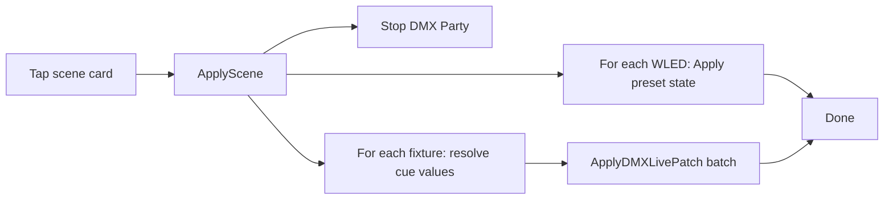

# Scenes + WLED Device Presets

## Product decisions (locked)

- **WLED**: Per-device named presets (create/manage on the device detail page). Scenes pick one preset per included WLED device.
- **DMX**: Scenes pick one existing Cue per included fixture (`fixtureId` + `cueId`).
- **UI**: One **Scenes** page with tabs **Apply** (switch-plate cards) and **Edit** (composer).
- **Persistence**: Scenes live in [`state.json`](internal/controller/controller.go) (with settings/devices), not `dmx.json`.
- **Share**: Dedicated scene export/import (portable JSON), for sharing a single scene.
- **Full backup**: Scenes and WLED device presets are included in Settings → Export/Import configuration backup (`.goldbus-backup.json`).

## Data model

Extend [`persistentState`](internal/controller/controller.go) and bump `persistentStateVersion` (3 → 4):

```go
type WLEDDevicePreset struct {
  ID        string         `json:"id"`
  Name      string         `json:"name"`
  State     map[string]any `json:"state"` // WLED /json/state payload
  CreatedAt time.Time      `json:"createdAt"`
  UpdatedAt time.Time      `json:"updatedAt"`
}

// on WLEDDevice:
Presets []WLEDDevicePreset `json:"presets,omitempty"`

type LightingScene struct {
  ID        string              `json:"id"`
  Name      string              `json:"name"`
  WLED      []SceneWLEDEntry    `json:"wled"`   // included devices only
  DMX       []SceneDMXEntry     `json:"dmx"`
  CreatedAt, UpdatedAt time.Time
}

type SceneWLEDEntry struct {
  DeviceID string `json:"deviceId"`
  PresetID string `json:"presetId"`
}

type SceneDMXEntry struct {
  FixtureID string `json:"fixtureId"`
  CueID     string `json:"cueId"`
}

// persistentState adds:
Scenes []LightingScene `json:"scenes,omitempty"`
```

Expose `Scenes` on `ControllerSnapshot` so the frontend lists them from the existing snapshot path.

**Portable export shape** (embeds resolved looks so IDs can rematch on another machine):

```json
{
  "version": 1,
  "exportedAt": "...",
  "scene": {
    "name": "Lobby Warm",
    "wled": [{ "deviceName": "...", "host": "...", "presetName": "...", "state": { ... } }],
    "dmx": [{ "fixtureBrand": "...", "fixtureName": "...", "cueLabel": "...", "values": { "1": 128 } }]
  }
}
```

On import: match WLED by `deviceId` then name/host; match fixtures by id then brand+name; create missing presets on matched devices; create the scene with remapped ids.

## Backend (Go / Wails)

In [`internal/controller/`](internal/controller/) + thin wrappers in [`goldbuslightservice.go`](internal/service/goldbuslightservice.go):

| API | Behavior |
|-----|----------|
| `CreateWLEDDevicePreset(deviceId, name)` | Capture live state via refresh/`GetDeviceDetail`, append preset, persist |
| `UpdateWLEDDevicePreset` / `DeleteWLEDDevicePreset` | CRUD on device |
| `ApplyWLEDDevicePreset(deviceId, presetId)` | `SetDeviceState` with stored state |
| `CreateScene` / `UpdateScene` / `DeleteScene` | CRUD on `persistentState.Scenes` |
| `ApplyScene(id)` | Stop Party + stop conflicting live if needed; for each WLED entry apply preset; for each DMX entry resolve cue `values` and batch `ApplyDMXLivePatch` (reuse logic from [`dmx_party_cues.go`](internal/controller/dmx_party_cues.go) / live patch path) |
| `ExportScene(id)` / `ImportScene(json)` | File dialogs like [`ExportDMXFixtureConfig`](internal/service/goldbuslightservice.go); write/read portable JSON |

### Full configuration backup (required)

Scenes and WLED presets must round-trip through [`ExportConfigurationBackup` / `ImportConfigurationBackup`](internal/controller/backup.go):

- Because both live in `state.json` (`persistentState.Scenes` + `WLEDDevice.Presets`), they are part of the `state.json` blob already written into the backup `Files` map.
- When building the in-memory `stateToBackup` in `ExportConfigurationBackup`, include `Scenes` (and device presets via cloned devices) — do not omit them when marshaling.
- On import, `ImportConfigurationBackup` already reloads `state.json`; verify load path restores `Scenes` into the controller and into `ControllerSnapshot`.
- Extend [`backup_test.go`](internal/controller/backup_test.go) with a case that creates a scene + a device preset, exports, imports into a fresh controller, and asserts both are present.

Regenerate Wails bindings after service methods land.

## Frontend

### Navigation

- Add `| { kind: "scenes" }` to [`DetailRoute`](frontend/src/types/controller.ts).
- **Scenes** button at the **top** of the sidebar in [`AppShell.tsx`](frontend/src/components/layout/AppShell.tsx) (above WLED/DMX sections), visible when `wledEnabled || dmxEnabled`.
- Branch in [`App.tsx`](frontend/src/App.tsx) → new `ScenesView`.

### WLED presets UI

In [`DeviceDetailView.tsx`](frontend/src/components/wled/device/DeviceDetailView.tsx): a **Presets** section — list presets, **Save current as preset** (name dialog), Apply, Delete. Wire through [`useControllerApp.ts`](frontend/src/hooks/useControllerApp.ts).

### Scenes UI — [`ScenesView`](frontend/src/components/scenes/)

Tabs (same pattern as Settings):

**Apply**
- Responsive card grid; tap/click card → `ApplyScene`.
- Optional small active/busy feedback on the card.

**Edit**
- Scene list + Create / Delete / Export / Import.
- Editor for selected scene:
  - Name field
  - **Dual listbox** (Available ↔ Included) for WLED devices and for DMX fixtures (no existing TransferList — build a small local component with two lists + add/remove buttons)
  - For each included WLED device: Select of that device’s presets
  - For each included DMX fixture: Select of that fixture’s `party.cueSequence.cues`
  - Save → `UpdateScene` / `CreateScene`

### Types + hooks

Mirror Go types in [`controller.ts`](frontend/src/types/controller.ts); CRUD/apply/import/export handlers in `useControllerApp` calling `GreetService.*`.

## Apply flow



Skip offline WLED devices with a console/status warning; skip missing preset/cue with a clear error rather than partial silent failure where possible.

## Out of scope (this pass)

- Timed scene sequences / fades between scenes
- Editing cue values inside the Scene editor (reference only)
- Auto-capturing WLED without creating a named preset first
