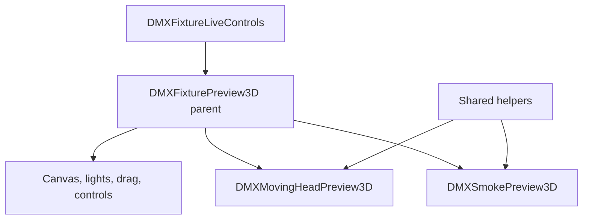

# Split Fixture Preview Plan

## Findings
- This is feasible and fairly low risk: [frontend/src/components/dmx/DMXFixturePreview3D.tsx](frontend/src/components/dmx/DMXFixturePreview3D.tsx) already separates behavior with `variant === "movingHead"` / `variant === "smoke"`, but the mesh loading, scene shell, drag handling, beam logic, and smoke particle logic are all in one file.
- The only current renderer call site is [frontend/src/components/dmx/DMXFixtureLiveControls.tsx](frontend/src/components/dmx/DMXFixtureLiveControls.tsx), where it passes `variant`, pan/tilt, beam props, smoke intensity, and drag callback.
- Existing meshes are only [frontend/public/meshes/moving_head.dae](frontend/public/meshes/moving_head.dae) and [frontend/public/meshes/smoke.dae](frontend/public/meshes/smoke.dae), so the first split can stay focused on these two without changing fixture data models.

## Proposed Structure
- Keep [frontend/src/components/dmx/DMXFixturePreview3D.tsx](frontend/src/components/dmx/DMXFixturePreview3D.tsx) as the parent/dispatcher component for API stability:
  - shared outer `
` styling
  - `<Canvas>`, camera, lights, `Suspense`, and `OrbitControls`
  - shared pan/tilt pointer-drag handling for moving-head previews
  - `variant` switch to render the fixture-specific child component
- Add [frontend/src/components/dmx/DMXMovingHeadPreview3D.tsx](frontend/src/components/dmx/DMXMovingHeadPreview3D.tsx):
  - moving-head Collada load from `/meshes/moving_head.dae`
  - `arm` / `head` node lookup and rest-pose rotation logic
  - beam cone creation, focus aperture, color/rainbow updates
- Add [frontend/src/components/dmx/DMXSmokePreview3D.tsx](frontend/src/components/dmx/DMXSmokePreview3D.tsx):
  - smoke Collada load from `/meshes/smoke.dae`
  - `emitter` node lookup
  - smoke particle geometry/material and animation
- Add a small shared helper file only if it keeps the split clean, likely [frontend/src/components/dmx/DMXFixturePreview3D.shared.ts](frontend/src/components/dmx/DMXFixturePreview3D.shared.ts), for:
  - `clamp01`, `degToRad`, `applyOpacity`
  - Collada scene clone/normalize helper if both children need it
  - shared preview prop types if importing from the parent would create awkward dependencies

## Implementation Notes
- Keep `DMXFixturePreview3DProps` compatible so [frontend/src/components/dmx/DMXFixtureLiveControls.tsx](frontend/src/components/dmx/DMXFixtureLiveControls.tsx) should need little or no behavioral change.
- Move fixture-specific constants with their fixture component: beam constants into `DMXMovingHeadPreview3D`, smoke particle constants into `DMXSmokePreview3D`.
- Keep the parent responsible for future extension by making the variant switch explicit; later fixture types can add another child component without growing the moving-head or smoke files.
- Preserve current interaction rules: moving heads are draggable when enabled, smoke previews are orbit-rotatable and not pan/tilt draggable.

## Verification
- Run `ReadLints` on the edited preview files and [frontend/src/components/dmx/DMXFixtureLiveControls.tsx](frontend/src/components/dmx/DMXFixtureLiveControls.tsx).
- Run `npm run build` in [frontend](frontend) to catch TypeScript/Vite errors.
- Manually verify both preview modes: moving-head pan/tilt drag, beam color/focus/rainbow behavior, and smoke output plume intensity.